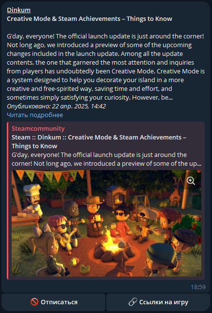

## Steam news bot

It's no secret that the steam platform has significant drawbacks and general slowness and
sluggishness. News about apps
and games there are in disarray and without sorting by date and time. This bot allows you to receive
the latest news
from application developers in a timely manner, in a convenient application (telegram) 

#### Project objectives:

Develop a telegram bot that will promptly deliver news on games and software from the steam
platform. 
Add the ability to ignore uninteresting applications. 
Place the bot on the linux(raspbian) server using PM2(advanced, production process manager for
node.js). 
Make the bot multilingual. 

#### What can the bot do?

1. The first and most important thing is that the bot does not use or store any private information
   about users. Only
   open sources and the steam API are used.
2. The bot determines the user's language from the set language in the telegram settings. Two
   languages are supported so
   far - Russian and English. (21.08.2022)
3. After the greeting, the bot will prompt the user to register. Registration is very simple, you
   only need a Steam ID.
   
4. When registering, the bot requests the user's application library from the steam, according to
   the entered Steam ID,
   and then saves the user's data to the database.
5. The bot has a scheduler.
    - Every 30 minutes, news is searched for and sent to users.
    - In case of problems (and the steam platform is not the
      most agile), problematic requests will be repeated every 5 minutes after failure.
    - Every 24 hours, the bot updates the user application database.
6. In the settings you can find: 
   
    - _"Set/Update Steam ID"_ - This is necessary for registration.
    - _"Check your steam ID"_ - Here you can see the installed steam ID and activity mode.
    - _"Check available wishlist"_ - Checking that the wishlist is available and news on games from
      the list will be received.
    - _"Set \"active\" mode"_ - Set the active mode. Only in this mode the bot will send you news.
    - _"Set \"inactive\" mode"_ - Set inactive mode if you are tired of the news in general.
    - _"Clear black list"_ - Clearing the blacklist.
    - _"Black list"_ - List of blacklisted applications.
7. You can add the application to the blacklist under the news. 
   
8. Added a wish list for accounts that have access to game information in steam settings. In order
   for the bot to get access to the desired list, the privacy settings in steam should look like
   this: (updated 21.08.2023) 
   

#### List of supported commands:

    /start
    /settings
    /help

#### List of used libraries:

1. telegram bots - library to create telegram bots
2. telegram bots extensions - extensions bots for telegram bots library
3. lombok - saves us from boilerplate code
4. log4j + logback - logger
5. sqlite (jdbc and dialect) - database
6. junit + mockito - tests (86% coverage)

####

Versions:

- Java: 17 
- Spring Boot: 2.7.2 
- SQLite: 3.36.0.3 
- Telegrambots: 6.1.0 
- Maven: 3.2.0 
- JUnit5: 5.8.2 
- Mockito: 4.5.1 

You can use its services yourself if it is online - https://t.me/steam_newsy_bot.

(update 21.08.2023)
I didn't rent a server for a bot, but just used ~~raspberries~~ mini-PC iRU 114. This is my little
production server
from improvised means.
